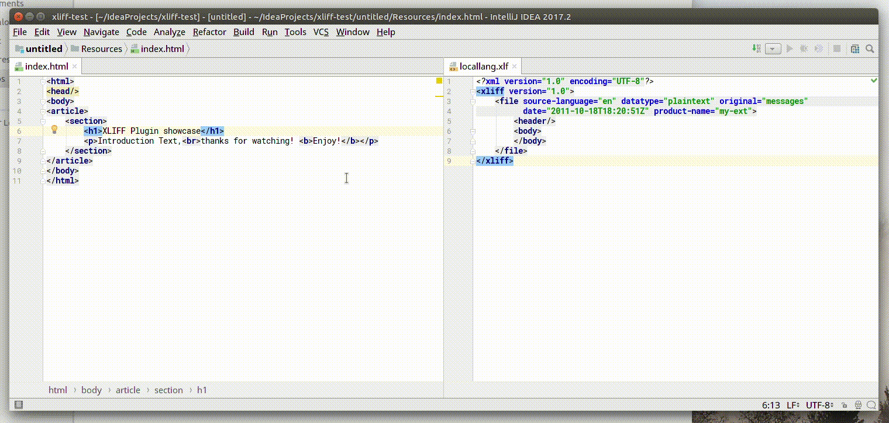

# TYPO3 XLIFF Translation plugin for Jetbrains Intellij IDE
Introduces (for now) only a refactoring action, to create and/or update existing `trans-unit` elements in a selected XLIFF file. Extracted text will be replaced with - *CAUTION* this is [TYPO3 Fluid](https://fluidtypo3.org/) feature - with the regular `<f:translate />` view helper.

## How to use
- Let my totally professional screencast speak for his self

# Misc
Feel free to contribute, submit issues or feature requests.
